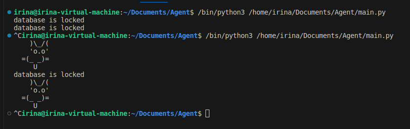

# Агент 
Пробный программный агент, который записывает и считает обращения к DNS доменам браузера Mozila firefox.
Адреса, которые посещает пользователь записываются в places.sqlite. 
*В этом файле содержатся все закладки Firefox, списки всех загруженных файлов и всех посещённых веб-сайтов.*

Агент считает все обращения к домену.
Агент считает обращения за все время, а не в рамках сессии

Программа не имеет доступа к БД, пока работает браузер. Она собирает статистику после закрытия всех окон

### Файлы

- main.py: основной файл программы
- visited_domains.txt: файл с доменами

Пример консольного вывода

